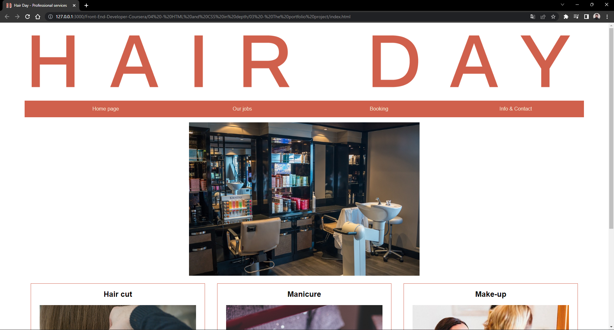
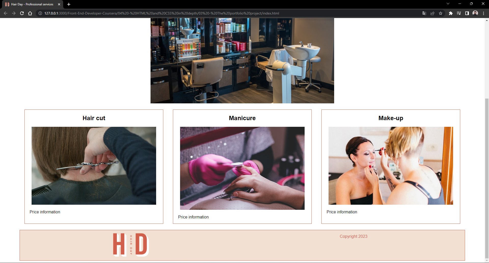
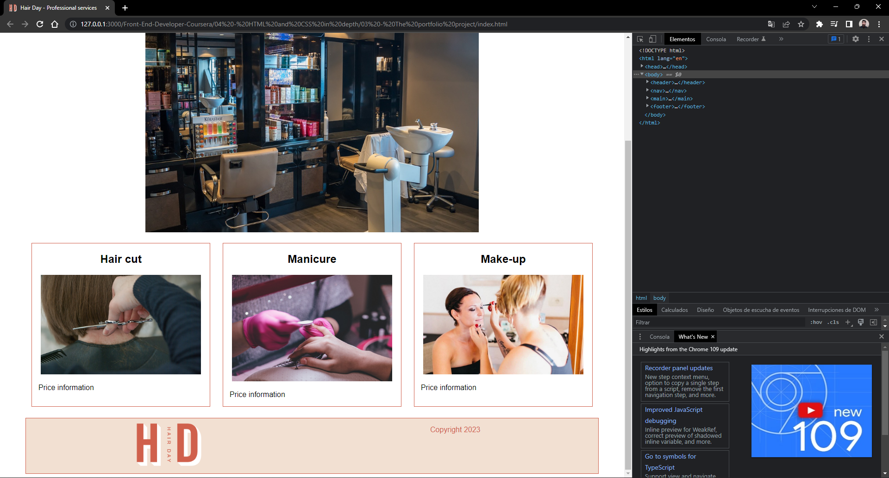
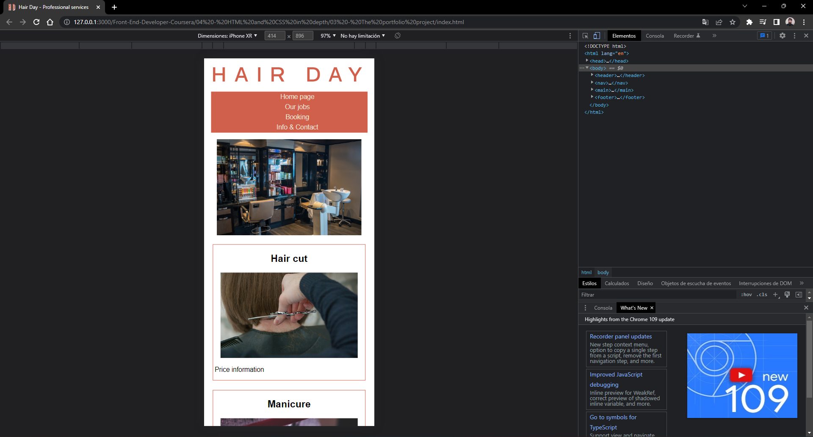

# About the portfolio project

By completing the lessons in this course, I've acquired the necessary HTML and CSS skills and knowledge to develop a home page with a header, main content and footer. I had to decide whether to use a grid or flexbox layout for the home page. The header had have contain the client logo and the main content had be a large promotional banner with three columns with text and images below it. The footer had have two columns: the first column with a small logo and the second one with copywriting information. About styling, I had to create the appropriate look and feel for client's target audience. It was necesary to create intentional engagement!

I had to select a fictional client, work out the layout, position the elements, plan the user experience, creat themes and set up my local development environment.

## What is the purpose of the portfolio project? What did I do?
The portfolio project helped me to establish which topics I've mastered, and which topics require further focus. Ultimately, the portfolio project is designed to help me make sure that I'm ready for the next course in the program. And what better way to do that than by applying your newly-learned skills in a practical way? 

I was free to use my creativity but the home page needed to meet certain criteria regarding the following:
* Visual layout
* Semantic structure
* CSS layout
* CSS styling
* CSS effects

## The fictional client
###  Professional services: Hair Day  

Based in Madison, Wisconsin, Hair Day is a boutique hair salon that specializes in cut, color and styling. Hair Day also offers makeup and nail services, prides itself on its warm and relaxing atmosphere and is best known for edgy hair colors and on-trend cuts. The salon can only accommodate a small number of coloring appointments each week, so clients need to book far in advance. To keep clients inspired between appointments, the employees share makeup and nail tutorials on the Hair Day website. 

Pria, the owner of Hair Day, earned her certificate as a colorist and immediately started specializing in edgy, custom coloring techniques. She wanted to create a "treat yourself" environment for her clients. Pria opened the salon with her good friend and talented hairdresser, Garry. They have a staff of seven: two stylists, three colorists, one manicurist and one make-up artist.

## Snaps

